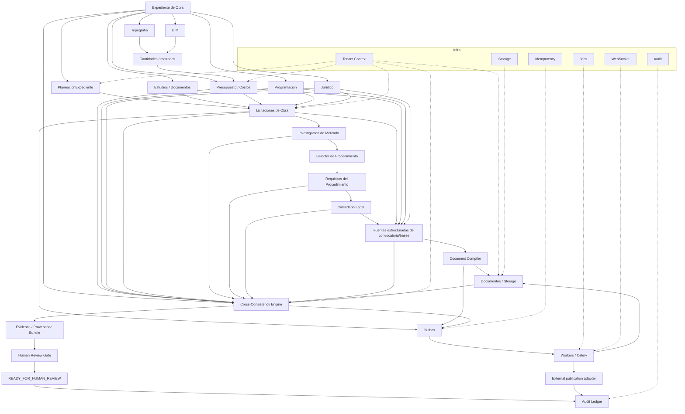

# MEGALODON V7 — PRR / PLAN DE IMPLEMENTACIÓN QUIRÚRGICO
## Objetivo: expediente federal real → licitación completa → `READY_FOR_HUMAN_REVIEW`

Fecha de corte: 2026-08-19
Fuente de verdad del software: código ejecutable del v7; README y documentación histórica NO son fuente de verdad.
Fixture oficial de integración: `reference/expediente_inbal_n3_2026.json` (procedimiento federal INBAL `LO-48-E00-048E00994-N-3-2026`).
Fixture negativo permanente: `reference/expediente_inbal_n3_2026_INCONSISTENTE.json`.

---

## 0. REGLA ARQUITECTÓNICA NO NEGOCIABLE

No se crea un "dominio canónico" que reemplace a los existentes.

Los dominios existentes conservan su propiedad:

- Expedientes → `models/expediente.py`, `services/expediente_service.py`, `api/v1/expedientes.py`.
- Planeación → `models/planeacion.py`.
- Costos/APU → `engines/costos/motor_costeo.py`, `services/catalogo_apu_service.py`, `services/presupuesto_service.py`.
- Presupuestos → `models/presupuesto.py`, `services/presupuesto_service.py`, `api/v1/presupuestos.py`.
- Topografía → `models/topografia.py`, `services/topografia_service.py`, `api/v1/topografia.py`.
- BIM → `models/bim.py`, `services/bim_service.py`, `engines/bim/motor_bim.py`, `api/v1/bim.py`.
- Programación → `models/programacion.py`, `services/programacion_service.py`, `engines/programacion/cpm.py`.
- Jurídico → `engines/juridico/*`, `services/juridico_service.py`, `api/v1/juridico.py`.
- Licitación → `models/licitacion.py`, `services/licitacion_service.py`, `api/v1/licitaciones.py`.
- Licitaciones de Obra → `api/v1/licitaciones_obra.py`; debe convertirse de fixture a flujo real, sin eliminar su responsabilidad.
- Documentos → `models/documento.py`, `services/documento_service.py`, `api/v1/documentos.py`, `modules/documentos/service.py`.
- Firma → `modules/firma/*`, `services/firma_service.py`.
- Validación → `engines/validadores/*`, `services/validador_service.py`, `api/v1/validadores.py`.
- Auditoría → `models/audit_ledger.py`, `modules/audit/service.py`, `modules/trazabilidad/ledger.py`.

Tezcatlipoca NO se modifica en esta fase. Sus siete proveedores (`ADSBfiClient`, `OpenSkyClient`, `USGSEarthquakeClient`, `CelesTrakClient`, `OpenMeteoClient`, `WebODMClient`, `GoogleEarthEngineClient`) quedan fuera del alcance de este pipeline.

La única pieza nueva de coordinación de negocio debe orquestar; no poseer los datos de otros dominios.

---

# 1. ESTADO ACTUAL QUE DISPARA LA REESCRITURA

## P0 — `api/v1/licitaciones_obra.py` es una fachada de fixtures

Archivo: `backend/app/api/v1/licitaciones_obra.py` (659 líneas).

Evidencia directa:

- `27-43`: `crear_planeacion()` devuelve `plan-0000...`, no inserta DB y declara fases como completadas.
- `45-61`: `obtener_planeacion()` devuelve `$5,000,000`, 180 días, fechas y folio hardcodeados.
- `67-89`: `publicar_convocatoria()` devuelve fechas, monto y fundamento hardcodeados; no publica.
- `91-120`: `obtener_convocatoria()` vuelve a fabricar requisitos y garantías.
- `126-145`: `registrar_proposicion()` genera `prop-0000...` y fecha fija.
- `147-184`: `listar_proposiciones()` devuelve tres empresas ficticias.
- `190-227`: `evaluar_proposiciones()` devuelve puntajes ficticios.
- `228-...`: las fases posteriores siguen el mismo patrón de datos prefabricados.
- `606-626`: `publicar-compranet()` cambia estado/respuesta sin evidencia de una publicación externa real.
- `632-659`: `resumen-ciclo` vuelve a presentar un ciclo completo sin reconstruirlo desde persistencia.

Acción: REESCRITURA INTERNA COMPLETA. No borrar el router; convertirlo en fachada real sobre servicios/engines existentes.

---

## P0 — contratos rotos en `LicitacionService`

Archivo: `backend/app/services/licitacion_service.py`.

Problemas:

- La tabla de transiciones usa estados que no coinciden con el enum de `models/licitacion.py`.
- Se usan `created_by` / `updated_by` donde los modelos de auditoría actuales usan `creado_por_id` / `actualizado_por_id`.
- Las entidades de `JuntaAclaracion` y `Proposicion` se instancian con campos que no corresponden al modelo actual.

Acción: REESCRIBIR servicio para que compile y que sus comandos coincidan 1:1 con `models/licitacion.py` y `schemas/licitacion.py`.

---

## P0 — `BaseService` permite operaciones sin tenant

Archivo: `backend/app/services/base.py`.

- `28-31`: `get(id)` no exige tenant.
- `70-84`: `update(id)` no exige tenant.
- `86-92`: `delete(id)` no exige tenant.

Acción: convertir el tenant en requisito estructural para modelos tenant-owned. Los métodos de lectura/escritura no deben existir en forma insegura.

---

## P0 — SQLAlchemy `metadata` reservado

Archivo: `backend/app/models/documento.py:87`.

`metadata` como atributo Declarative es inválido/reservado.

Acción: renombrar el atributo Python a `metadata_extra` (o equivalente) conservando la columna SQL `metadata` si se desea compatibilidad de esquema.

---

# 2. ARQUITECTURA OBJETIVO EXACTA



## Regla del diagrama

Ninguna caja reemplaza a otra.

`Licitaciones de Obra` sigue siendo su propio dominio.
`Presupuesto` sigue siendo su propio dominio.
`Topografía` sigue siendo su propio dominio.
`BIM` sigue siendo su propio dominio.
`Jurídico` sigue siendo su propio dominio.

El nuevo componente de coordinación sólo invoca esos dominios y registra la evidencia de que todos produjeron resultados compatibles.

---

# 3. NUEVAS PIEZAS QUE SÍ HAY QUE CREAR

No se crean todas como modelos gigantes. Son capacidades concretas.

## 3.1 `backend/app/services/licitacion_preparation_service.py`

Responsabilidad: orquestación de preparación.

NO posee el estado de Presupuesto/Topografía/BIM/Jurídico.

Recibe:

```python
PreparationContext(
    tenant_id,
    expediente_id,
    user_id,
    correlation_id,
)
```

Ejecuta etapas:

```text
LOAD_EXPEDIENTE
→ VERIFY_INPUTS
→ LOAD_PLANEACION
→ LOAD_ESTUDIOS
→ LOAD_TOPOGRAFIA
→ LOAD_BIM
→ LOAD_PRESUPUESTO
→ LOAD_PROGRAMACION
→ RUN_INVESTIGACION_MERCADO
→ SELECT_PROCEDIMIENTO
→ BUILD_REQUIREMENTS
→ BUILD_CALENDAR
→ BUILD_DOCUMENT_SOURCE
→ COMPILE_DOCUMENTS
→ RUN_VALIDATORS
→ RUN_CROSS_CONSISTENCY
→ BUILD_EVIDENCE
→ HUMAN_REVIEW_GATE
```

Cada etapa devuelve un resultado persistible y un `stage_run_id`.

No debe guardar en un JSON gigantesco todo el expediente.

---

## 3.2 `backend/app/models/preparation_run.py`

Una ejecución del pipeline.

Campos mínimos:

```text
id
tenant_id
expediente_id
triggered_by
correlation_id
pipeline_version
status
current_stage
started_at
finished_at
failure_code
failure_detail
```

Estados:

```text
RUNNING
BLOCKED
FAILED
READY_FOR_HUMAN_REVIEW
CANCELLED
```

Esto permite reproducir el caso INBAL y comparar versiones de pipeline.

---

## 3.3 `backend/app/models/preparation_stage_run.py`

Cada nodo del pipeline debe dejar evidencia de ejecución.

```text
id
preparation_run_id
stage
status
input_refs
output_refs
started_at
finished_at
rule_version
engine_version
error_code
error_detail
```

Resultado esperado para un run bueno:

```text
EXPEDIENTE          PASS
PLANEACION          PASS
TOPOGRAFIA          PASS/NOT_REQUIRED
BIM                 PASS/NOT_REQUIRED
COSTOS              PASS
PRESUPUESTO         PASS
MERCADO             PASS
JURIDICO            PASS
REQUISITOS          PASS
CALENDARIO          PASS
DOCUMENTOS          PASS
VALIDADORES         PASS
CONSISTENCY         PASS
EVIDENCE            PASS
REVIEW_GATE         PASS
```

---

# 4. PLANEACIÓN

## Modificar

`backend/app/models/planeacion.py`.

El modelo ya contiene la base correcta: necesidad, justificación, objetivo, alcance, presupuesto, financiamiento, fechas, hitos, riesgos y aprobación.

## Crear

`backend/app/services/planeacion_service.py`.

Métodos mínimos:

```text
crear(expediente_id, data)
obtener(expediente_id)
actualizar(id, data)
aprobar(id)
validar_completitud(id)
```

## Integración

Debe producir una salida estructurada que consuma el preparador:

```text
objeto
alcance
presupuesto_estimado
fuente_financiamiento
fecha_inicio_esperada
fecha_fin_esperada
duracion_estimada
hitos
riesgos
estado
```

## Regla

Una planeación en `BORRADOR` no puede alimentar `READY_FOR_HUMAN_REVIEW`.

---

# 5. TOPOGRAFÍA

NO REESCRIBIR EL MOTOR.

Conservar:

- `services/topografia_service.py`
- `engines/...` existentes
- `api/v1/topografia.py`

Añadir al adaptador de preparación:

```text
get_topografia_context(expediente_id)
```

Debe devolver:

```text
levantamientos usados
superficies usadas
volúmenes
metrados
unidades
versiones
artifact/document refs
```

Punto crítico: si el expediente de licitación necesita una cantidad derivada de topografía, el resultado debe llevar:

```text
source_type=TOPOGRAFIA
source_id=<calculo>
source_version=<version>
```

El precio no debe inventarse en topografía.

Topografía produce geometría/cantidad; Costos produce precio.

---

# 6. BIM

Conservar:

- `models/bim.py`
- `services/bim_service.py`
- `engines/bim/motor_bim.py`
- workers BIM.

Añadir método de integración:

```text
get_bim_quantities_context(expediente_id)
```

Salida:

```text
model_id
model_version
quantity_set_id
quantities
units
clash_report_ref
artifact_refs
```

Si BIM y Topografía producen la misma cantidad, `CrossConsistencyEngine` debe comparar ambas fuentes.

---

# 7. COSTOS / APU / PRESUPUESTO

## Conservar

`backend/app/engines/costos/motor_costeo.py`

El motor ya tiene APU/precio unitario/cantidad.

## Integración necesaria

El expediente debe poder fijar un `presupuesto_snapshot`.

No debe volver a recalcularse automáticamente una vez congelado para la convocatoria.

Crear:

`backend/app/services/presupuesto_snapshot_service.py`

Métodos:

```text
crear_snapshot(presupuesto_id)
obtener_snapshot(snapshot_id)
comparar(snapshot_a, snapshot_b)
congelar(snapshot_id)
```

La licitación de obra debe referenciar:

```text
presupuesto_id
presupuesto_version
presupuesto_snapshot_id
```

---

# 8. INVESTIGACIÓN DE MERCADO

## Problema actual

`schemas/licitacion.py:174` sólo define `InvestigacionMercadoCreate` como estructura de entrada.

Eso NO es un proceso.

## Crear

`backend/app/models/investigacion_mercado.py`

`backend/app/services/investigacion_mercado_service.py`

Campos mínimos:

```text
id
tenant_id
expediente_id
licitacion_id
fecha
metodologia
fuentes
proveedores_contactados
cotizaciones
materiales
mano_obra
maquinaria_equipo
precios_referencia
precio_total_estimado
dispersion
existencia_contratistas
conclusion
evidence_document_ids
version
status
```

La definición normativa del Reglamento de la LOPSRM considera materiales, mano de obra, maquinaria/equipo, precio total estimado y existencia de contratistas. citeturn896587search12

La investigación debe producir un resultado, no sólo guardarse en `Licitacion.investigacion_mercado` como JSON.

---

# 9. SELECCIÓN DEL PROCEDIMIENTO JURÍDICO

## Conservar

`engines/juridico/motor_juridico.py`
`engines/juridico/selector_procedimiento.py`
`engines/juridico/umbrales_referencia.py`
`services/juridico_service.py`

## Reescribir el contrato de salida

Debe producir:

```text
DecisionProcedimiento
├── procedimiento
├── jurisdiccion
├── ejercicio
├── fundamento
├── articulo
├── fraccion
├── fecha_vigencia
├── facts_used
├── evidence_refs
├── rule_version
├── confidence_state
├── required_authorizations
├── blockers
└── status
```

Estados:

```text
CANDIDATE
VERIFIED
REQUIRES_PRIMARY_SOURCE
BLOCKED
```

No debe existir una ruta que convierta una excepción legal en adjudicación directa sólo porque la justificación tenga longitud suficiente.

La LOPSRM vigente establece licitación pública como regla general y regula los supuestos de excepción; la motivación/fundamentación y acreditación correspondiente no se pueden sustituir por una validación de longitud de texto. citeturn896587search13

---

# 10. REQUISITOS

## Crear

`backend/app/models/requisito_licitacion.py`
`backend/app/services/requisito_licitacion_service.py`
`backend/app/engines/juridico/requirement_engine.py`

Cada requisito:

```text
codigo
descripcion
stage
obligatorio
aplica_si
no_aplica_si
fundamento
fuente_version
evidencia_requerida
document_type
blocking
validation_rule
```

La salida debe permitir generar una matriz:

```text
REQUISITO
→ fundamento
→ evidencia requerida
→ evidencia encontrada
→ resultado
```

No basta `reglas_participacion` como JSON libre.

---

# 11. CALENDARIO LEGAL

## Crear

`backend/app/engines/juridico/procurement_calendar.py`

Entrada:

```text
jurisdiccion
procedimiento
fecha_publicacion
fecha_visita
fecha_junta
fecha_limite_aclaraciones
fecha_apertura
fecha_fallo
fecha_firma
```

Salida:

```text
calendario
validaciones
fundamentos
violations
```

El modelo actual guarda varias fechas como strings en `models/licitacion.py`.

Debe migrarse a `Date`/`DateTime` donde corresponda.

El motor debe comprobar las ventanas legales aplicables y no permitir que la convocatoria llegue al estado de revisión si hay una fecha inválida.

---

# 12. FUENTE ESTRUCTURADA DE CONVOCATORIA Y BASES

## No usar el texto como fuente primaria

`models/licitacion.py` tiene `bases: Text`.

Conservarlo como artefacto final.

Agregar estructuras:

`backend/app/models/bases_licitacion.py`
`backend/app/models/convocatoria.py`

Con secciones estructuradas:

```text
identificacion
tipo_procedimiento
objeto
alcance
ubicacion
monto
plazo
fuente_financiamiento
fecha_publicacion
visita_sitio
junta
apertura
fallo
firma
requisitos
criterios_evaluacion
garantias
causas_desechamiento
proyecto
especificaciones
anexos
```

La convocatoria debe generarse desde esas estructuras.

La LOPSRM vigente exige que la convocatoria contenga información específica del procedimiento, objeto, requisitos, fechas, visita, junta, presentación/apertura, garantías y elementos técnicos, entre otros. citeturn896587search13

---

# 13. DOCUMENT COMPILER

## Crear

`backend/app/modules/documentos/licitacion_document_compiler.py`

Entrada:

```text
ConvocatoriaSource
BasesSource
AnexosSource
PresupuestoSnapshot
Calendario
RequirementsMatrix
LegalDecision
EvidenceBundle
```

Salida:

```text
DocumentArtifact
├── document_id
├── type
├── version
├── sha256
├── storage_key
├── generated_from
├── template_version
└── generated_at
```

Documentos mínimos:

```text
convocatoria
bases
anexo_tecnico
catalogo_conceptos
presupuesto
programa_obra
investigacion_mercado
justificacion_procedimiento
matriz_requisitos
matriz_evaluacion
checklist_juridico
reporte_consistencia
bundle_evidencias
```

No se debe generar un PDF final si falta un documento obligatorio.

---

# 14. CROSS-CONSISTENCY ENGINE

## Crear

`backend/app/engines/validadores/cross_consistency.py`

Este es el motor clave.

Debe comparar, como mínimo:

```text
Expediente.objeto
       ==
Licitacion.objeto
       ==
Convocatoria.objeto
       ==
Bases.objeto
```

```text
Presupuesto.total
       ==
Convocatoria.monto_estimado
```

```text
Presupuesto.version
       ==
Licitacion.presupuesto_snapshot.version
```

```text
Catalogo.cantidad
       ==
AnexoTecnico.cantidad
```

```text
Programa.duracion
       ==
Convocatoria.plazo
```

```text
Procedimiento seleccionado
       ==
Procedimiento documentado
       ==
Procedimiento publicado
```

```text
Criterios del motor de evaluación
       ==
Criterios de bases
       ==
Matriz de evaluación
```

```text
Requisitos
       ==
Documentos exigidos
       ==
Matriz de requisitos
```

```text
Calendario interno
       ==
Convocatoria
```

El fixture inconsistente debe provocar errores bloqueantes y jamás llegar a `READY_FOR_HUMAN_REVIEW`.

---

# 15. EVIDENCE / PROVENANCE

## Crear

`backend/app/models/evidence.py`
`backend/app/services/evidence_service.py`

No es un "modelo canónico" de negocio. Es trazabilidad.

Debe guardar:

```text
id
tenant_id
claim_type
claim_key
source_type
source_id
source_version
field_path
extracted_value
normalized_value
rule_id
rule_version
verification_state
verified_at
verified_by
artifact_hash
```

Ejemplo:

```text
claim = monto_estimado
source = presupuesto_snapshot#123
field = total
value = 12850000.00
rule = convocatoria.monto == presupuesto.total
result = PASS
```

Esto permite contestar: "¿Por qué Megalodon dice que este monto es correcto?"

---

# 16. VALIDADORES

## Conservar

`engines/validadores/motor_validador.py`
`services/validador_service.py`
`api/v1/validadores.py`

## Rehacer el contrato de salida

Cada validador debe producir:

```text
ValidationResult
├── validator_id
├── entity
├── status
├── blocking
├── message
├── evidence_refs
├── rule_ref
├── observed_value
├── expected_value
└── executed_at
```

No permitir que un booleano como `firma_valida=True` sea tomado como evidencia primaria.

Los validadores que dependan de un documento real deben apuntar al `DocumentoCDE`, hash y versión.

---

# 17. HUMAN REVIEW GATE

## Crear

`backend/app/services/human_review_gate.py`

Reglas mínimas:

```text
READY_FOR_HUMAN_REVIEW
si y sólo si:

P0 = 0
legal blockers = 0
consistency blockers = 0
required documents = complete
required evidence = complete
procedure decision = VERIFIED
calendar = VALID
budget snapshot = FROZEN
```

Si falta una fuente jurídica primaria:

`REQUIRES_PRIMARY_SOURCE`

No `READY`.

Si hay contradicción entre monto/plazo/documentos:

`BLOCKED`.

---

# 18. LICITACIONES DE OBRA — REESCRITURA

Archivo que permanece:

`backend/app/api/v1/licitaciones_obra.py`

Pero pierde toda lógica fixture.

Sus endpoints deben delegar:

```text
POST /planeacion
→ PlaneacionService

GET /planeacion/{id}
→ PlaneacionService

POST /{id}/preparar
→ LicitacionPreparationService

GET /{id}/preparacion/{run_id}
→ PreparationRunService

POST /{id}/convocatoria
→ ConvocatoriaService + DocumentCompiler

GET /{id}/convocatoria
→ ConvocatoriaService

POST /{id}/validar
→ ValidationOrchestrator

GET /{id}/consistency
→ CrossConsistencyEngine

GET /{id}/evidence
→ EvidenceService

POST /{id}/review/approve
→ HumanReviewGate
```

Los endpoints históricos de proposiciones/contrato/estimaciones/bitácora pueden conservarse y seguir su propio dominio, pero NO deben fingir datos.

---

# 19. `LicitacionService` Y `Licitaciones de Obra` NO SE FUSIONAN

`api/v1/licitaciones.py` mantiene el dominio `Licitacion`.

`api/v1/licitaciones_obra.py` mantiene el flujo especializado de obra pública.

La relación debe ser explícita si una licitación de obra necesita un registro en `Licitacion`:

```text
LicitacionObra
   |
   +-- licitacion_id (si aplica)
   +-- expediente_id
   +-- presupuesto_snapshot_id
   +-- preparation_run_id
```

No se comparte una entidad gigantesca.

---

# 20. OUTBOX

## Crear

`backend/app/models/outbox.py`
`backend/app/services/outbox_service.py`
`backend/app/workers/outbox_dispatcher.py`

Campos:

```text
id
tenant_id
aggregate_type
aggregate_id
event_type
event_version
payload
correlation_id
status
attempts
next_attempt_at
published_at
last_error
created_at
```

Cada transacción de negocio que genere efectos externos debe insertar evento en la misma transacción DB.

---

# 21. IDEMPOTENCY

## Crear

`backend/app/models/idempotency.py`
`backend/app/services/idempotency_service.py`

Unique:

```text
(tenant_id, operation, idempotency_key)
```

Debe cubrir al menos:

```text
crear expediente derivado
crear licitación
preparar licitación
compilar documentos
publicar
webhooks
jobs externos
```

Una repetición con la misma llave y payload debe devolver el mismo resultado.

Una repetición con distinta huella de payload debe devolver conflicto.

---

# 22. JOBS

Conservar Celery.

Crear una abstracción durable de job:

`backend/app/models/job.py`
`backend/app/services/job_service.py`

Debe guardar:

```text
id
tenant_id
type
aggregate_type
aggregate_id
status
attempts
idempotency_key
payload_hash
progress
error
created_at
started_at
finished_at
heartbeat
```

Esto permitirá ejecutar de forma fiable:

- generación PDF/DOCX;
- OCR;
- BIM;
- topografía pesada;
- compilación de paquete;
- publicación externa.

---

# 23. DOCUMENTOS Y STORAGE

Conservar `DocumentoService` y Supabase Storage.

Agregar un manifest del paquete:

`backend/app/models/document_bundle.py`

```text
bundle_id
preparation_run_id
document_id
document_type
version
sha256
sequence
required
status
```

El paquete final debe poder reconstruirse sin volver a calcular precios o reglas.

---

# 24. AUDITORÍA

Conservar:

- `modules/audit/service.py`
- `modules/trazabilidad/ledger.py`

Corregir:

- tenant scope en consultas;
- append-only real en DB;
- `correlation_id`;
- `preparation_run_id`;
- referencias a evidence/document/package.

Un evento del pipeline debe poder responder:

```text
quién
qué
cuándo
tenant
input
output
motor
versión
regla
resultado
```

---

# 25. FRONTEND

Conservar `frontend/app/src/apps/licitaciones-obra`.

Cambiar su dependencia de fixtures.

Actualmente `megalodon-client.ts:1787-1828` apunta a los endpoints de `licitaciones-obra`; eso está bien como frontera de API, pero las respuestas deben venir del flujo real.

Agregar vistas para:

```text
PreparationRun
StageRun
BlockingIssues
Evidence
Consistency
DocumentBundle
HumanReview
```

Pantalla principal:

```text
EXPEDIENTE
│
├── Inputs
├── Planeación
├── Estudios
├── Costos
├── Presupuesto
├── Mercado
├── Jurídico
├── Requisitos
├── Calendario
├── Documentos
├── Consistencia
├── Evidencia
└── Revisión humana
```

Cada sección debe mostrar estado real del backend.

---

# 26. FIXTURE OFICIAL INBAL — CONVERTIRLO EN TEST E2E PERMANENTE

Archivo actual:

`reference/expediente_inbal_n3_2026.json`

Debe moverse a una ubicación permanente de tests, por ejemplo:

`backend/tests/e2e/fixtures/inbal_n3_2026.json`

Y el negativo:

`backend/tests/e2e/fixtures/inbal_n3_2026_inconsistent.json`

No borrar los originales del paquete PRR; versionar las copias de test.

---

# 27. TEST E2E PRINCIPAL

Archivo:

`backend/tests/e2e/test_licitacion_preparation_inbal.py`

Debe demostrar:

```python
fixture = load_fixture()

expediente = create_expediente(fixture)
planeacion = create_planeacion(expediente)
topografia = seed_topografia_if_required(fixture)
bim = seed_bim_if_required(fixture)
presupuesto = build_or_load_presupuesto(fixture)
mercado = create_market_research(fixture)
procedure = select_procedure(expediente, mercado)
requirements = build_requirements(procedure, expediente)
calendar = build_calendar(procedure, fixture)
documents = compile_documents(...)
validation = run_validators(...)
consistency = run_cross_consistency(...)
evidence = build_evidence(...)

assert consistency.blocking_errors == 0
assert validation.blocking_errors == 0
assert evidence.complete is True
assert preparation.status == "READY_FOR_HUMAN_REVIEW"
```

No debe aceptar `READY` si alguna pieza devuelve fixture/mock data.

---

# 28. TEST NEGATIVO PERMANENTE

Usar:

`inbal_n3_2026_inconsistent.json`

Debe introducir al menos:

```text
monto inconsistente
plazo inconsistente
precio de mercado inconsistente
```

Expectativa:

```text
status = BLOCKED
blocking_errors >= 3
```

Debe fallar con mensajes deterministas y evidence refs.

---

# 29. TEST DE TENANT A/B

Crear:

```text
Tenant A → expediente INBAL A
Tenant B → expediente INBAL B
```

Probar:

```text
A cannot GET B preparation run
A cannot GET B evidence
A cannot GET B document
A cannot GET B consistency report
A cannot approve B
```

Los IDs no deben filtrar existencia del recurso ajeno.

---

# 30. TEST DE IDEMPOTENCIA

Repetir:

```text
POST /preparar
POST /document-compile
POST /publish
```

con la misma `Idempotency-Key`.

Resultado: una sola ejecución efectiva.

---

# 31. TEST DE CRASH/RECOVERY

Durante:

```text
compile_documents
cross_consistency
external_publish
```

matar el worker.

Tras reinicio:

```text
job persisted
stage_run persisted
outbox still present
retry/resume works
```

No debe terminar en `SUCCESS` sin evidencia.

---

# 32. TEST DE PROVIDER FAILURE

No pertenece al core de licitación salvo publicación externa.

Para la publicación externa:

```text
provider 500
provider timeout
provider 429
```

Resultado:

```text
PENDING / RETRYING / FAILED
```

Nunca `PUBLISHED` sin receipt.

---

# 33. TEST DE BACKUP/RESTORE

Después de un `READY_FOR_HUMAN_REVIEW`:

backup DB + manifest storage.

Restore en DB limpia.

Recalcular:

```text
preparation_run
stage_runs
evidence
consistency
document_bundle
audit chain
```

Comparar hashes.

---

# 34. DEFINITION OF DONE DEL NÚCLEO

El núcleo sólo recibe GO cuando el fixture INBAL cumple:

```text
[PASS] Expediente persistido
[PASS] Planeación persistida
[PASS] Estudios referenciados
[PASS] Topografía/BIM o NOT_REQUIRED justificado
[PASS] Presupuesto snapshot congelado
[PASS] Investigación de mercado persistida
[PASS] Selector jurídico VERIFIED
[PASS] Requirements matrix completa
[PASS] Calendar válido
[PASS] Convocatoria estructurada
[PASS] Bases estructuradas
[PASS] Document bundle generado
[PASS] Validators PASS
[PASS] Cross-consistency PASS
[PASS] Evidence complete
[PASS] Audit complete
[PASS] Tenant isolation
[PASS] Idempotency
[PASS] Crash/recovery
[PASS] READY_FOR_HUMAN_REVIEW
```

El fixture negativo debe terminar obligatoriamente en:

```text
[PASS] detecta contradicciones
[PASS] bloquea READY
```

---

# 35. ORDEN DE IMPLEMENTACIÓN — NO PARALELIZAR INDISCRIMINADAMENTE

## Fase 0 — reparación de runtime

1. `models/documento.py` metadata.
2. `services/licitacion_service.py` contratos.
3. `models/licitacion.py` estados.
4. `services/base.py` tenant mandatory.
5. imports/runtime/dependencies.

## Fase 1 — pipeline estructural

6. `PlaneacionService`.
7. `InvestigacionMercado` real.
8. `PreparationRun` + `StageRun`.
9. `LicitacionPreparationService`.

## Fase 2 — automatización

10. Requirement Engine.
11. Procurement Calendar.
12. estructura de Convocatoria/Bases.
13. Document Compiler.
14. Evidence Service.
15. CrossConsistency Engine.
16. Human Review Gate.

## Fase 3 — convertir `licitaciones_obra.py`

17. eliminar fixtures.
18. conectar endpoints reales.
19. persistir todas las transiciones.
20. publicar paquete generado, no fabricar URL/respuesta.

## Fase 4 — infraestructura de confiabilidad

21. Outbox.
22. Idempotency.
23. Job model.
24. retries/DLQ/requeue.
25. audit strengthening.

## Fase 5 — frontend

26. estados de preparación.
27. issues bloqueantes.
28. evidencia.
29. documento bundle.
30. human review.

## Fase 6 — PRR bruto

31. fixture control.
32. fixture negativo.
33. tenant A/B.
34. idempotency.
35. crash/restart.
36. Redis/Postgres/storage failure.
37. outbox/requeue/DLQ.
38. WebSocket.
39. backup/restore.

---

# 36. LO QUE NO SE TOCA

Esta fase NO modifica el dominio Tezcatlipoca.

NO elimina:

- Topografía.
- BIM.
- Costos.
- Programación.
- Jurídico.
- Compliance.
- Firma.
- Auditoría.
- Documentos.
- Contratos.
- Licitaciones.

No se crea un objeto "MegalodonCanonical".

No se convierte todo el sistema en una sola tabla.

No se reemplaza el dominio de `Licitaciones de Obra` por `Licitacion`.

No se usa IA/LLM para resolver las reglas jurídicas del núcleo.

---

# 37. ESTADO TARGET

La arquitectura final debe poder expresarse así:

```text
                   ┌─────────────────────────────┐
                   │    LICITACION PREPARATION   │
                   │         ORCHESTRATOR        │
                   └─────────────┬───────────────┘
                                 │
       ┌───────────────┬─────────┼──────────┬──────────────┐
       ▼               ▼         ▼          ▼              ▼
 Planeación        Costos     Jurídico   Documentos    Programación
       │               │         │          │              │
       └───────────────┴─────────┴──────────┴──────────────┘
                                 │
                                 ▼
                      CrossConsistency Engine
                                 │
               ┌─────────────────┴─────────────────┐
               ▼                                   ▼
         Evidence Bundle                    Validation Report
               │                                   │
               └─────────────────┬─────────────────┘
                                 ▼
                       HUMAN REVIEW GATE
                                 │
                                 ▼
                    READY_FOR_HUMAN_REVIEW
```

La palabra clave es `ORCHESTRATOR`, no `CANONICAL`.

---

# 38. CRITERIO FINAL DE ÉXITO

Megalodon no estará terminado cuando tenga todos estos archivos.

Estará terminado cuando el fixture real pueda recorrer el pipeline y demostrar, con registros persistidos y auditables:

```text
qué entró
→ qué módulo lo procesó
→ qué regla aplicó
→ qué evidencia utilizó
→ qué produjo
→ qué documento generó
→ qué validación pasó
→ qué contradicciones descartó
→ quién debe revisar
```

Y el sistema sólo podrá producir:

`READY_FOR_HUMAN_REVIEW`

cuando pueda demostrar todo lo anterior.

---

# FUENTES OFICIALES DE REFERENCIA JURÍDICA / PLATAFORMA

1. LOPSRM vigente — Cámara de Diputados:
https://www.diputados.gob.mx/LeyesBiblio/pdf/LOPSRM.pdf

2. Reglamento LOPSRM — Cámara de Diputados:
https://www.diputados.gob.mx/LeyesBiblio/regley/Reg_LOPSRM.pdf

3. Compras MX — Plataforma Digital de Contrataciones Públicas:
https://comprasmx.buengobierno.gob.mx/compras-mx

4. Compras MX — mejoras / transición de la plataforma:
https://comprasmx.buengobierno.gob.mx/mejoras

5. RUPC — expediente electrónico de proveedores/contratistas:
https://comprasmx.buengobierno.gob.mx/rupc

---

# VEREDICTO PRR

Actualmente: `NO-GO`.

Objetivo de esta fase: convertir el flujo de preparación en una cadena determinista y auditable.

La evidencia de aceptación no será una captura de pantalla ni un README: será el fixture INBAL ejecutado end-to-end hasta `READY_FOR_HUMAN_REVIEW`, más el fixture inconsistente bloqueado por `CrossConsistencyEngine` y `ValidationEngine`.
